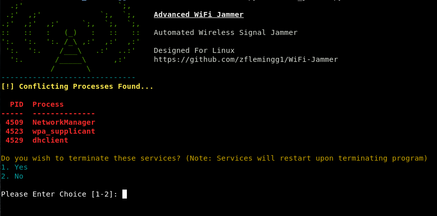
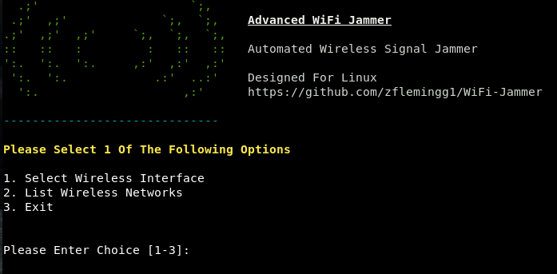
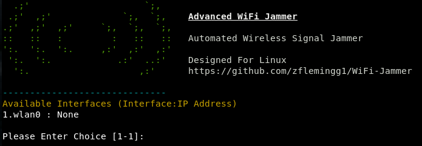
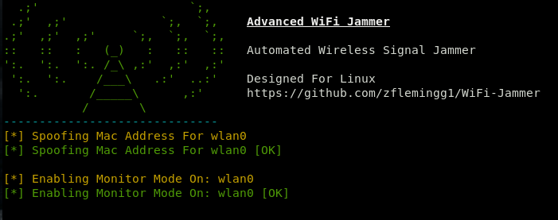
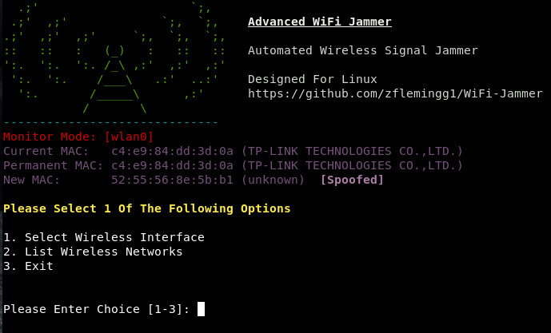
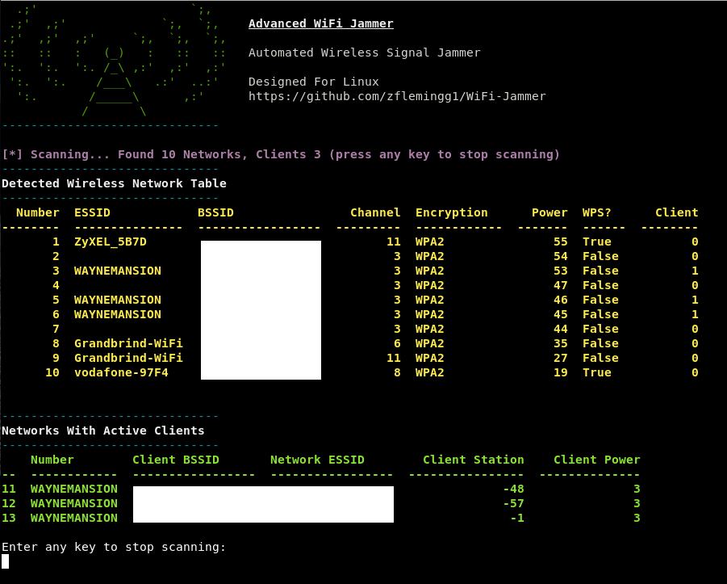
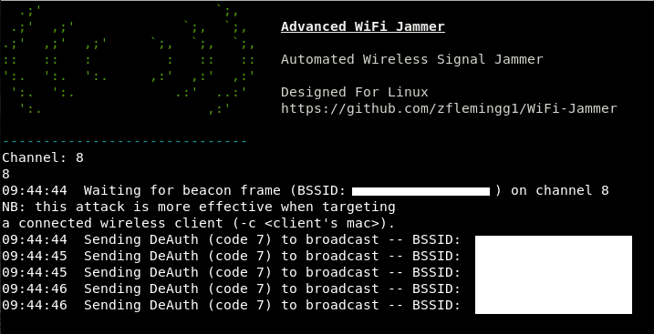
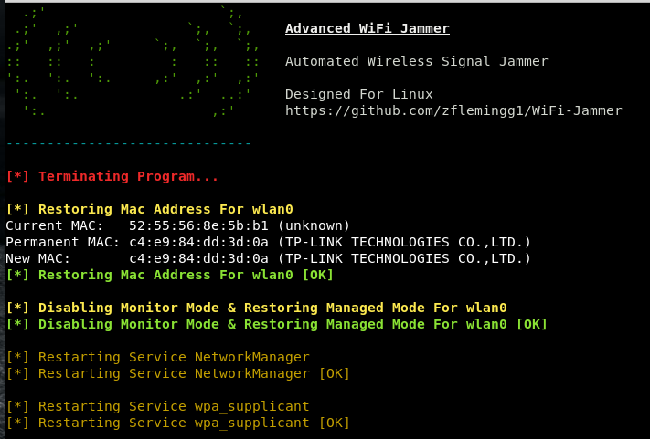

# WiFi-Jammer
Simple Python automated tool to jam all traffic for either selected clients or networks within range and disconnect them from their AP. Simple Menu Interface to automate the entire process. 

### Launching the program

To use the program simply open up a terminal navigate to the directory and run it with "python wifi-jammer.py"

### Running The Program
As soon as the program starts it checks for any processes that may interfere with it. You can then either select option 1 to kill these processes or option 2 to ignore. Note if you kill them, they will be restarted as soon as the program is terminated

Next you select your wireless interface

The program will then take steps to spoof your mac adress as an anti forensics measure and enable monitor mode on your chosen interface

THe user then chooses to scan for target networks

The user then chooses either to target a client or an entire network

To exit the program the user just has to press Ctrl+C. This will terminate the program and run the clean up process. The clean up process will restart all terminated process in step one if any. It will then restore the interfaces original mac address and put the interface back in managed mode. 

### Built With

* Python 2.7.14

### Authors

*** Zach Fleming --> zflemingg1@gmail.com

